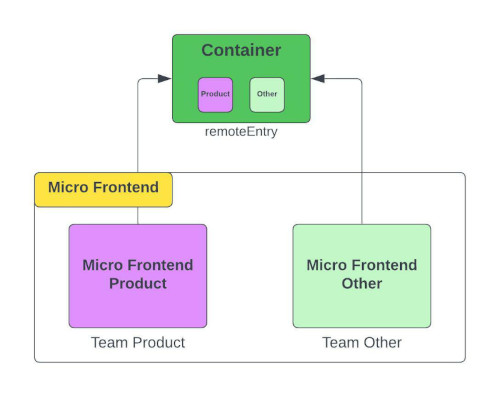
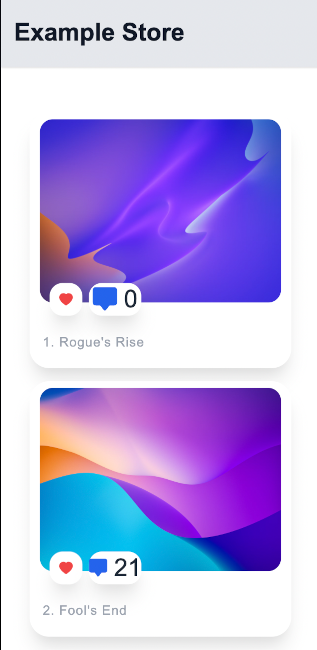
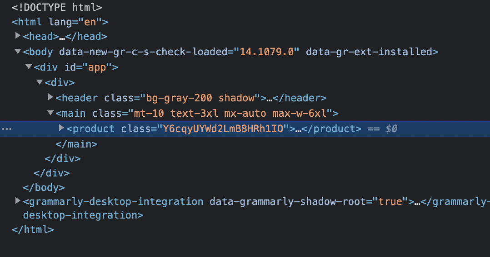

# ReactJS Micro Frontend Example

### Dependencies
- React 17^ 
- Tailwindcss 2^

    

### Manual Installation 
1. Run project Product 
    -   ```sh
        cd product
        ```
    -   ```sh
        npm i
        ```
    -   ```sh
        npm run start
        ```

2. Run project Container 
    -   ```sh
        cd container
        ```
    -   ```sh
        npm i
        ```
    -   ```sh
        npm run start
        ```

2. Open url ```http://localhost:8080```

    - Result

        


    - Element MF Product
        
        
    
    
    - Network Hook MF Product

        

### Contact
https://www.linkedin.com/in/aji-indra-jaya

License
----

MIT